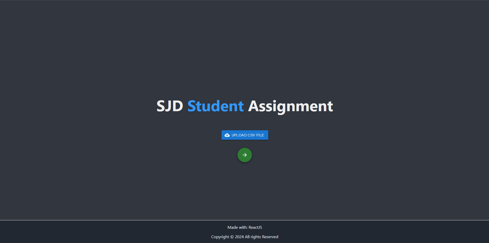

# SJDD Student Assignments

## Showcase / Demo:

## Introduction
Web App created with ReactJS 
 
Objective: Assign open workplaces to the students, prioritizing grade and preferences 
 
Libraries used: MaterialUI & sweetalert

## Description
The app reads a CSV file with a specific format provided by the end user, with all the information about the students and the open workplaces available to them. Next, it processes all the data to assign each of the students to an open position, based on the grade, the number of suspended subjects, and the preferences provided by them. 
 
The web app was created to be used as a tool in the education and management field by the client 

## Disclaimer
Warning: The project uses very specific file formats for processing data provided by the client! It is not designed for "public use" 

 
 

## Available Scripts

In the project directory, you can run:

##### `npm start`

Runs the app in the development mode.\
Open [http://localhost:3000](http://localhost:3000) to view it in your browser.

The page will reload when you make changes.\
You may also see any lint errors in the console.
